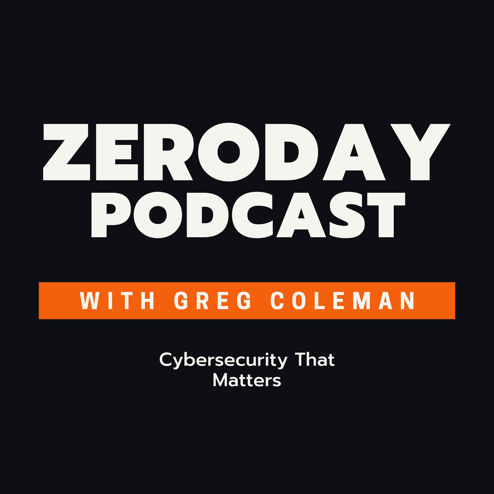

# The Zeroday Podcast

---
##About
---
The ZeroDay podcast is the companion podcast to the Zeroday newsletter, a free weekly newsletter covering cybersecurity, cyberattacks, and cyber prevention. This is a podcast about CyberSecurity, the latest corporate cyberattacks attacks, and what you can do to protect your company from the latest cyberattacks. We will also discuss the latest hacks and the latest terminology you need to navigate the ever-changing landscape of cybersecurity. You can find the ZeroDay newsletter at (https://zeroday.substack.com/) our website and the podcast on Spotify and iTunes. Subscribe to the podcast and the newsletter as we will be bringing you news from the world of cybersecurity every week.

---
##Links
---

- [iTunes](https://podcasts.apple.com/us/podcast/zeroday-podcast/id1575913599)
- [Spotify](https://open.spotify.com/show/5US5vNx1CYfMNqXkr1y8U3)
- [Google Podcasts](https://podcasts.google.com/feed/aHR0cHM6Ly9ncmVnb3J5Y29sZW1hbi5naXRodWIuaW8vemVyb2RheS1wb2RjYXN0L3BvZGNhc3QueG1s)

---
&copy; 2021 Gregory Coleman

